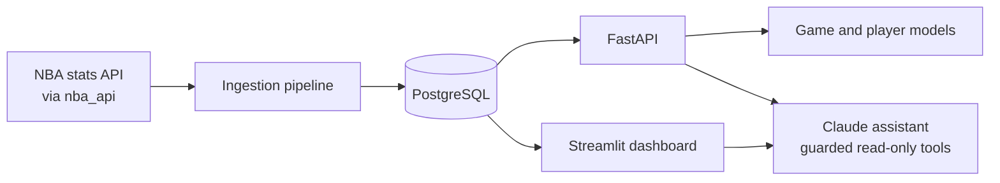

# NBA Analytics Platform


An end-to-end NBA data platform: a REST API, a data pipeline into Postgres, an interactive dashboard, advanced metrics, machine-learning predictions, and an AI assistant that answers questions about the data by querying it.

## What it does

- **Explore** players, teams, games, and box scores through a REST API and a Streamlit dashboard.
- **Analyze** with advanced metrics computed from raw box scores: true shooting %, usage rate, AST%, REB%, Game Score, per-36 stats, team pace, offensive/defensive/net rating, and the Four Factors.
- **Visualize** rolling-form trends, shot charts, efficiency-vs-volume plots, and 5-man and 2-man lineup ratings.
- **Predict** game outcomes (home win probability) and player stat lines (points, rebounds, assists, each with an 80% range).
- **Ask** questions in plain English. A Claude-powered assistant answers using tools that query the database, and shows exactly which queries it ran.

## Architecture



| Layer | Technology |
|---|---|
| Language | Python 3.12 |
| Data source | [`nba_api`](https://github.com/swar/nba_api) |
| API | FastAPI, Pydantic |
| Database | PostgreSQL (SQLite works for quick local runs), SQLAlchemy 2.0, Alembic |
| Dashboard | Streamlit, Plotly |
| ML | scikit-learn (logistic regression, histogram gradient boosting), custom Elo |
| Infrastructure | Docker, GitHub Actions |

## Project structure

```
app/             FastAPI application: routers, SQLAlchemy models, schemas, config
analytics/       Pure-function metric calculations (TS%, usage, ratings, Four Factors)
pipeline/        Ingestion (games, shots, lineups) and derived-metric jobs
ml/              Elo, feature engineering, training, prediction, model quality gate
assistant/       Claude agent loop, tools, SQL guard, rate limits, evaluation harness (planned for future)
dashboard/       Streamlit app: Home.py, pages/, queries.py, court drawing
migrations/      Alembic migrations
tests/           pytest suite
scripts/         Production data-refresh script
.github/         CI and deploy workflows, Dependabot config
```

## Data model

| Table | Contents |
|---|---|
| `teams`, `players` | Reference data |
| `games` | One row per game: date, season, season type, teams, final score |
| `team_game_stats`, `player_game_stats` | Box score rows per team or player per game |
| `player_season_advanced`, `team_season_advanced` | Derived season-level advanced metrics |
| `shots` | Shot locations and outcomes (loaded for top scorers) |
| `lineup_stats` | 5-man and 2-man lineup ratings and minutes |

## Getting started

### Prerequisites

- Python 3.12
- Docker Desktop (for local PostgreSQL)
- An [Anthropic API key](https://console.anthropic.com) (only needed for the AI assistant)

### Setup

```bash
git clone https://github.com/YOUR_GITHUB_USERNAME/nba-analytics-platform.git
cd nba-analytics-platform

python3 -m venv .venv
source .venv/bin/activate
python -m pip install -r requirements.txt

cp .env.example .env        # then edit .env (see Configuration below)
docker compose up -d        # starts PostgreSQL
python -m alembic upgrade head
```

### Load the data

```bash
# Games and box scores (a few minutes for ten seasons)
python -m pipeline.ingest --seasons 2016-17 2017-18 2018-19 2019-20 2020-21 2021-22 2022-23 2023-24 2024-25 2025-26

# Derived metrics, lineups, and shot locations for the top 100 scorers
python -m pipeline.derive
python -m pipeline.lineups --seasons 2023-24 2024-25 2025-26
python -m pipeline.shots --season 2025-26 --top 100

# Train the prediction models
python -m ml.train_game_model
python -m ml.train_player_model
```

Every loader is idempotent (upserts), so re-running it never duplicates data. Running `python -m pipeline.ingest` with no arguments refreshes only the latest season.

### Run it

```bash
python -m uvicorn app.main:app --reload            # API at http://127.0.0.1:8000/docs
python -m streamlit run dashboard/Home.py          # Dashboard at http://localhost:8501
```

Or run the production Docker image locally:

```bash
docker compose --profile app up --build            # API :8080, dashboard :8081
```

### Configuration

Set these in `.env` (never commit it):

| Variable | Purpose | Default |
|---|---|---|
| `DATABASE_URL` | SQLAlchemy URL for the main database | `sqlite:///data/nba.db` |
| `READONLY_DATABASE_URL` | Read-only role used by the assistant's SQL tool | same as `DATABASE_URL` |
| `ANTHROPIC_API_KEY` | Enables the AI assistant | unset (assistant disabled) |
| `ANTHROPIC_MODEL` | Claude model ID | `claude-sonnet-5-5` |
| `ASSISTANT_MAX_PER_HOUR` | Questions per visitor per hour | `20` |
| `ASSISTANT_MAX_PER_DAY` | Global questions per day | `300` |

For the strongest safety, create a database role that can only `SELECT`:

```sql
CREATE ROLE nba_readonly LOGIN PASSWORD 'choose-a-password';
GRANT USAGE ON SCHEMA public TO nba_readonly;
GRANT SELECT ON teams, players, games, team_game_stats, player_game_stats,
                player_season_advanced, team_season_advanced, shots, lineup_stats
      TO nba_readonly;
```

## API

Interactive documentation is served at `/docs`.

| Endpoint | Description |
|---|---|
| `GET /health`, `GET /ready` | Liveness and database readiness |
| `GET /players?search=&active_only=&limit=` | Search players |
| `GET /players/{id}`, `GET /players/{id}/career` | Player details and per-season averages |
| `GET /teams`, `GET /teams/{id}`, `GET /teams/{id}/roster?season=` | Teams and rosters |
| `GET /games?season=&team_id=`, `GET /games/{id}` | Games and results |
| `GET /predict/game?home_team_id=&away_team_id=&game_date=` | Home win probability |
| `GET /predict/player/{id}?opponent_id=&game_date=&home=` | Points, rebounds, assists with 80% ranges |
| `POST /assistant/chat` | Ask a question about the data |

## Dashboard pages

Home (standings, league leaders) · Player Explorer · Team Explorer · Games and box scores · Compare Players · Advanced Stats · Trends · Shot Charts · Lineups · Predictions · Ask the Data

## Machine learning

**Game outcomes.** Features are built only from games played *before* each game: rolling and season-to-date team ratings (net, offensive, defensive), the Four Factors, rest days, back-to-backs, and a margin-of-victory Elo rating. Models are compared with **walk-forward validation** (train on earlier seasons, test on the next one) against two baselines: always picking the home team, and Elo alone. The best model by log loss is saved.

**Player stat lines.** Gradient-boosted models predict points, rebounds, and assists from rolling form, minutes, opponent defense and pace, home/away, and rest. Separate 10th and 90th percentile models provide an 80% prediction range. Results are compared with the player's season average and last-10-game average.

**Results** (from `python -m ml.train_game_model` and `python -m ml.train_player_model`):

| Game model (mean over test seasons) | Accuracy | Log loss |
|---|---|---|
| Home-team baseline | TBD | TBD |
| Elo only | TBD | TBD |
| Logistic regression | TBD | TBD |
| Gradient boosting | TBD | TBD |

| Player model (held-out season) | MAE: season avg | MAE: last 10 | MAE: model | 80% range coverage |
|---|---|---|---|---|
| Points | TBD | TBD | TBD | TBD |
| Rebounds | TBD | TBD | TBD | TBD |
| Assists | TBD | TBD | TBD | TBD |

**Leakage safeguards.** Rolling features use only earlier games (`shift(1)`), Elo is recorded before each update, and tests change a game's own result and assert its features do not move. In serving, a placeholder row for the upcoming game runs through the same feature code as training. A quality gate (`python -m ml.check_models`) blocks deployment if a retrained model fails to beat its baselines, if its accuracy is implausibly high (a leakage tripwire), or if its prediction ranges are badly calibrated.

## AI assistant

The assistant uses Claude with tool use. Claude decides which tools to call, the application runs them against the database, and every number in an answer comes from a tool result. The dashboard's "How I got this" expander shows each tool call and SQL query.

**Tools:** `find_player`, `find_team`, `get_player_stats`, `get_team_stats`, `league_leaders`, `predict_game`, `predict_player`, and `run_sql` for open-ended questions.

**`run_sql` safety layers**

1. The query is parsed and must be exactly one `SELECT`. Anything else is rejected.
2. Only the nine application tables are allowed, with no schema prefixes, table functions, or dangerous functions.
3. A row limit is added, and the regenerated SQL (not the raw string) is executed.
4. It runs in a read-only transaction with a 5-second timeout.
5. In production it connects as a database role that can only `SELECT`.

**Evaluation.** `python -m assistant.evaluate` asks real questions whose correct answers are computed straight from the database with SQL, then checks the assistant's answers. It also checks that the assistant admits missing data (injuries, contracts) and refuses to modify data. The SQL guard and agent loop have offline unit tests that need no API key.

**Cost controls.** Per-visitor and daily question caps, a bounded number of tool round-trips per question, and a spend limit set in the Anthropic Console.

## Testing and quality

```bash
pytest -q                     # unit tests (no network or API key needed)
ruff check .                  # lint
python -m assistant.evaluate  # end-to-end assistant evaluation (makes real API calls)
```

CI runs lint and tests on every pull request and push.

## Deployment

- **Database:** Neon (managed PostgreSQL).
- **Apps:** two Fly.io apps (API and dashboard) built from one Docker image, with auto-stop when idle.
- **CI/CD:** on merge to `main`, and weekly, GitHub Actions runs the tests, retrains the models on production data, applies the quality gate, deploys both apps, and smoke-tests `/ready`.
- **Credentials:** deployed apps and CI use a read-only database role. Migrations and data refreshes run from a trusted machine with owner credentials.
- **Data refresh:** `scripts/refresh_prod.sh` (ingest, derive, lineups), scheduled with launchd on a Mac. NBA stats endpoints often block cloud IP ranges, so ingestion runs from a residential connection.

Run migrations against production with `alembic upgrade head` using the owner `DATABASE_URL`.

## Design decisions

- **Time-based validation, real baselines.** NBA games are noisy, so a good game model reaches the mid-60s in accuracy. Beating Elo and the home-team baseline honestly matters more than a headline number.
- **Precomputed derived tables.** Advanced metrics are stored, so the dashboard and assistant read them instantly and consistently.
- **Layered SQL safety.** Validation, allowlisting, read-only transactions, timeouts, and a read-only database role each work even if another layer fails.
- **Scale-to-zero hosting.** Idle apps and the database cost close to nothing, at the price of a cold start on the first request.

## Limitations

- Predictions do not know about injuries, lineups, or trades.
- Shot data is loaded only for top scorers, and lineup data covers a subset of seasons.
- The assistant endpoint is rate-limited but not authenticated, and its limits are per process.
- Usage, AST%, and REB% use team totals from the games each player appeared in, so they differ slightly from Basketball-Reference.
- There is no live or in-game data.

## Roadmap

- Player on/off splits
- Injury data and lineup-aware predictions
- Streaming assistant responses
- Authentication for the assistant endpoint

## Acknowledgments and disclaimer

Data comes from the unofficial [`nba_api`](https://github.com/swar/nba_api) client for NBA statistics endpoints. This project is for educational and personal use and is not affiliated with or endorsed by the NBA.